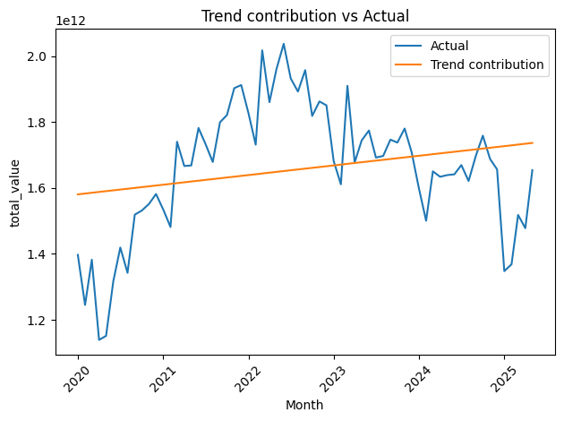
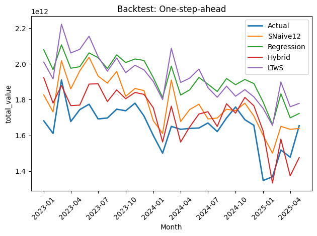
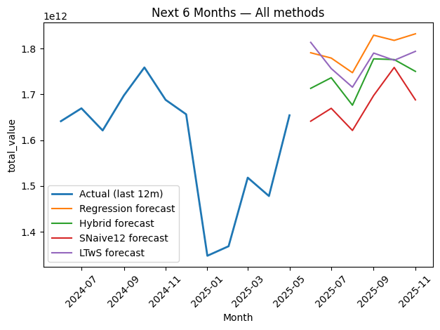

# IC Value Forecasting (2025) — Global Integrated Circuits (IC)

Forecasting monthly **global IC export values** for the remainder of **2025** using classical and regression-based time-series models. We compare **SNaive12**, **Linear Trend with Seasonality (LTwS/CMAT)**, **Regression with Fourier seasonality**, and a **Hybrid (Regression + lag residuals)** to select a production forecast for planning/S\&OP.

> **Result:** Strong seasonality (Feb low; Sep–Nov high). **Hybrid** wins out-of-sample (≈ **\$0.13T RMSE**). 6-month outlook: **moderate rebound** with seasonal peaks in **Aug–Oct**.&#x20;

---

## 📊 Key Charts

| Trend & Seasonality                                    | Backtest (Walk-forward)                                | 2025 Forecast                                          |
| ------------------------------------------------------ | ------------------------------------------------------ | ------------------------------------------------------ |
|  |  |  |

**Reading notes (from slides):**

* Post-COVID rebound, **2020→2022** surge, then stabilization.
* Baseline **SNaive12** performs decently due to strong seasonality, but **Hybrid** improves RMSE and realism.&#x20;

---

## 🧠 Methods

**Data:** UN Comtrade monthly exports (Jan-2020 → Jun-2025).
Filters: exports only; drop aggregates (“World”), positive values; prefer `primaryValue` (fallback `fobvalue`); month index built from `period (YYYY-MM)`.&#x20;

**Models evaluated:**

* **SNaive12** (seasonal naïve, same month last year)
* **LTwS/CMAT** (linear trend on centered moving average + seasonal indices)
* **Regression w/ seasonality:** time trend + **month dummies** / **Fourier (K=1..2)**
* **Hybrid:** Regression + **lagged residual** model (adds short-memory correction)

**Evaluation:**

* **Walk-forward / expanding window** backtest
* Primary metric: **RMSE** (lower is better)
* Parameter sweep for Ridge α, Fourier **K**, lag set, and min train window.&#x20;

---

## 📈 Findings

* **Seasonality dominates:** SNaive12 is a strong baseline → confirms monthly pattern stability.
* **Regression + Fourier** captures smooth seasonality; **LTwS** is conservative.
* **Hybrid** reliably reduces forecast error by modeling residual short-memory components.
* **Operational takeaways (slides):** Plan **pull-up** for **Sep–Nov**; anticipate **Feb slowdown**; use **Hybrid** as central forecast with **±\$0.13T** band for budgeting/S\&OP.&#x20;

---

## 📄 References

* Project slides: **“Final Project DS IC Value Forecasting on 2025.pdf.”** Figures and summary text above are sourced from these slides.&#x20;

---

## 🙌 Credits

* Data: **UN Comtrade**
* Author: **Rizky Febri Ibra Habibie**
* Contact: [rizkyfebriibrahabibie@gmail.com](mailto:rizkyfebriibrahabibie@gmail.com) · LinkedIn: [/in/rizkyfebriibrahabibie/](https://www.linkedin.com/in/rizkyfebriibrahabibie/)

---
